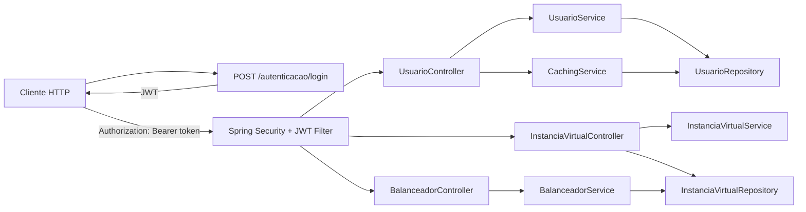
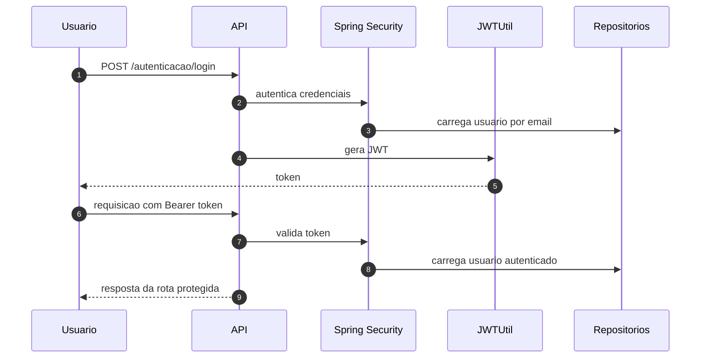

# Projeto Nuvem

[](https://github.com/MarcosAlves90/fatec-projeto-nuvem/actions/workflows/ci.yml)


API Spring Boot para gestao de instancias virtuais, balanceamento de carga, autenticacao JWT e CRUD de usuarios com cache.

## Visao geral

O projeto expoe uma API stateless protegida por JWT. As rotas de usuarios, instancias e balanceamento exigem autenticacao, enquanto `/autenticacao/**` permanece publica para geracao de tokens.

### Principais capacidades

- CRUD de usuarios com cache de leitura
- Login com JWT e validade configuravel em minutos
- Protecao de rotas via Spring Security
- Gestao de instancias virtuais
- Ativacao, inativacao e simulacao de custo hora
- Balanceamento simples entre instancias ativas
- Base H2 em memoria com dados iniciais

## Arquitetura



## Tecnologias

- Java 19
- Spring Boot 4.0.3
- Spring Web MVC
- Spring Data JPA
- Spring Security
- Spring Cache
- H2 Database
- JWT com `jjwt` 0.12.6

## Como executar

```bash
./mvnw spring-boot:run
```

## Acesso rapido

- Base URL local: `http://localhost:8080`
- Console H2: `http://localhost:8080/h2-console`
- Autenticacao: `POST /autenticacao/login`

## Configuracao

Nao ha variaveis de ambiente obrigatorias para subir a aplicacao localmente. As principais configuracoes estao em `src/main/resources/application.properties` e podem ser sobrescritas se necessario.

| Propriedade | Valor atual | Finalidade |
| --- | --- | --- |
| `spring.application.name` | `projeto_nuvem` | Nome logico da aplicacao |
| `spring.datasource.url` | `jdbc:h2:mem:nuvem_db` | Banco H2 em memoria |
| `spring.datasource.username` | `sa` | Usuario do banco H2 |
| `spring.datasource.password` | vazio | Senha do banco H2 |
| `spring.h2.console.enabled` | `true` | Habilita o console web do H2 |
| `spring.h2.console.path` | `/h2-console` | Caminho do console H2 |
| `spring.jpa.show-sql` | `true` | Exibe SQL no console |
| `spring.jpa.hibernate.ddl-auto` | `create` | Recria o schema ao subir a aplicacao |
| `spring.jpa.database-platform` | `org.hibernate.dialect.H2Dialect` | Dialeto do banco |

## Testes

```bash
./mvnw test
```

## Banco de dados

### H2 em memoria

- URL: `jdbc:h2:mem:nuvem_db`
- Console: `/h2-console`
- Usuario: `sa`
- Senha: vazia

### Seed inicial

O `import.sql` cria instancias virtuais de exemplo e um usuario inicial:

- E-mail: `pessoa1@claudinho.com`
- Senha: `senha`
- Role: `USER`

## Autenticacao

Gerar token:

```http
POST /autenticacao/login?username=...&password=...&duracao=15
```

- `duracao` e opcional e representa a validade do token em minutos
- A resposta e o JWT
- Nas demais requisicoes, envie:

```http
Authorization: Bearer <token>
```

### Exemplo com `curl`

```bash
curl -X POST "http://localhost:8080/autenticacao/login?username=pessoa1@claudinho.com&password=senha&duracao=15"
```

### Exemplo de resposta

```text
eyJhbGciOiJIUzI1NiJ9.eyJzdWIiOiJwZXNzb2ExQGNsYXVkZGluaG8uY29tIiwiaWF0IjoxNzE3MDAwMDAwLCJleHAiOjE3MTcwMDA5MDB9....
```

## Rotas

### Autenticacao

| Metodo | Rota | Descricao |
| --- | --- | --- |
| POST | `/autenticacao/login` | Gera token JWT |

### Usuarios

| Metodo | Rota | Descricao |
| --- | --- | --- |
| GET | `/usuario/todos` | Lista todos os usuarios |
| GET | `/usuario/{id}` | Busca um usuario por ID |
| POST | `/usuario/novo` | Cria um usuario |
| PUT | `/usuario/{id}/atualizar` | Atualiza um usuario |
| DELETE | `/usuario/{id}/remover` | Remove um usuario |

Exemplo autenticado:

```bash
curl -H "Authorization: Bearer <token>" \
  http://localhost:8080/usuario/todos
```

### Exemplo de resposta

```json
[
  {
    "email": "pessoa1@claudinho.com",
    "status": "ATIVO",
    "pessoaDTO": {
      "id": 1,
      "nome": "Pessoa 1",
      "emailAlternativo": "pessoa1@gmail.com"
    }
  }
]
```

### Instancias virtuais

| Metodo | Rota | Descricao |
| --- | --- | --- |
| POST | `/instancia-virtual/nova` | Cria uma nova instancia virtual |
| GET | `/instancia-virtual/todas` | Lista todas as instancias |
| GET | `/instancia-virtual/{id}` | Busca uma instancia por ID |
| PATCH | `/instancia-virtual/{id}/ativar` | Ativa uma instancia |
| PATCH | `/instancia-virtual/{id}/inativar` | Inativa uma instancia |
| POST | `/instancia-virtual/simular-elasticidade` | Calcula o custo hora de elasticidade |

Exemplo de simulacao:

```bash
curl -X POST \
  -H "Authorization: Bearer <token>" \
  -H "Content-Type: application/json" \
  -d '{"virtualCpu":4,"armazenamentoGb":80,"memoriaRamGb":16}' \
  http://localhost:8080/instancia-virtual/simular-elasticidade
```

### Exemplo de resposta

```text
4.0
```

### Balanceamento

| Metodo | Rota | Descricao |
| --- | --- | --- |
| GET | `/balanceador` | Atribui a requisicao para uma instancia ativa |

Exemplo:

```bash
curl -H "Authorization: Bearer <token>" \
  http://localhost:8080/balanceador
```

### Exemplo de resposta

```text
A requisicao/sessao foi atribuida para instancia:
Nome: instancia-1
SO: LINUX_UBUNTU
Status: Ativa
Qtd de Requisicoes: 1
```

## Fluxo de uso



## Estrutura do projeto

- `control` - controllers da API
- `dto` - objetos de transferencia
- `mapper` - conversao manual entre entidades e DTOs
- `model` - entidades e enums
- `repository` - acesso aos dados
- `security` - autenticacao, JWT e configuracao de seguranca
- `service` - regras de negocio

## Observacoes

- O projeto usa H2 em memoria, entao os dados sao recriados ao subir a aplicacao.
- A listagem de usuarios usa cache e as operacoes de alteracao limpam o cache.
- Todas as rotas, exceto `/autenticacao/**`, exigem autenticacao.
